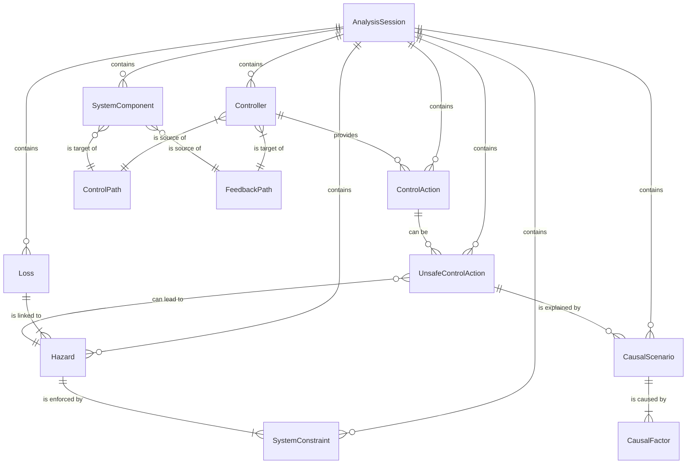

Loaded cached credentials.
Here is the Data Structures chapter for the design document.

# Chapter 4: System Design and Architecture

## 4.1. Data Structures

The STAMP Web Tool's data architecture is designed to be robust, scalable, and type-safe, leveraging TypeScript for defining clear and consistent data models. These structures underpin the entire analysis process, from initial project setup to final report generation. They ensure data integrity and facilitate the complex relationships between different analysis artifacts.

The core data types are defined in `/src/types/types.ts`.

### 4.1.1. AnalysisSession

The `AnalysisSession` and `AnalysisFolder` interfaces provide the foundational structure for organizing and managing analyses. They handle project metadata, analysis type, and hierarchical organization within the user's workspace.

-   **`AnalysisFolder`**: Allows for the grouping of related analysis sessions, supporting nested structures for better organization.
-   **`AnalysisSession`**: Represents a single, self-contained STPA or CAST analysis. It stores top-level metadata, such as the analysis title, creation/update timestamps, and the current step in the STAMP methodology. The `folderId` establishes its relationship with an `AnalysisFolder`.

```typescript
export interface Identifiable {
  id: string;
}

export interface AnalysisFolder extends Identifiable {
  name: string;
  description?: string;
  createdAt: string;
  updatedAt: string;
  parentFolderId?: string; // For nested folders
  isExpanded?: boolean;
}

export interface AnalysisSession extends Identifiable {
  analysisType: AnalysisType | null;
  title: string;
  createdBy: string;
  createdAt: string;
  updatedAt: string;
  currentStep: string;
  scope?: string;
  folderId?: string; // Optional folder assignment
}
```

### 4.1.2. Core Analysis Artifacts (Loss, Hazard, SystemConstraint)

These interfaces represent the fundamental artifacts defined in Step 1 of the STPA methodology. They form the basis for the entire safety analysis.

-   **`Loss`**: Defines a high-level, unacceptable outcome for the system (e.g., loss of life, mission failure). Each loss is given a unique code for reference.
-   **`Hazard`**: Describes a system state or condition that, under certain environmental conditions, could lead to a loss. Each hazard is linked to one or more losses via `linkedLossIds`.
-   **`SystemConstraint`**: Specifies a requirement or constraint on the system's design or behavior, derived directly from a hazard. It defines what the system must do or not do to prevent the hazard from occurring. Each constraint is linked to a single hazard via `hazardId`.

The `code` property in each artifact is automatically generated to ensure a consistent and traceable naming convention (e.g., L-1, H-1, SC-1).

```typescript
export interface Loss extends Identifiable {
  code: string;
  title: string;
  description: string;
  rationale?: string;
  isStandard?: boolean;
}

export interface Hazard extends Identifiable {
  code: string;
  title: string;
  systemComponent: string;
  environmentalCondition: string;
  systemState: string;
  linkedLossIds: string[];
}

export interface SystemConstraint extends Identifiable {
  code: string;
  text: string;
  hazardId: string;
  shallNotMustNot?: 'shall not' | 'must not';
}
```

### 4.1.3. Control Structure Elements

These data structures define the components of the system's control structure diagram, which is central to Step 2 of STPA. They model the system's architecture, including controllers, controlled processes, and the communication paths between them.

-   **`SystemComponent`**: Represents a physical or process-based element in the system that is being controlled.
-   **`Controller`**: Represents a decision-making entity within the control structure. This can be a human, a software component, a team, or an organization, as defined by the `ControllerType` enum. The `x` and `y` properties store its position on the visual canvas.
-   **`ControlPath`**: Models the flow of control actions from a `Controller` to a `SystemComponent` or another `Controller`.
-   **`FeedbackPath`**: Models the flow of feedback or information from a `SystemComponent` or `Controller` back to a `Controller`.

```typescript
export enum ComponentType {
  Physical = 'Physical',
  Process = 'Process',
}

export enum ControllerType {
  Software = 'S',
  Human = 'H',
  Team = 'T',
  Organisation = 'O',
}

export interface SystemComponent extends Identifiable {
  name: string;
  type: ComponentType;
  description?: string;
  x?: number;
  y?: number;
}

export interface Controller extends Identifiable {
  name: string;
  ctrlType: ControllerType;
  description?: string;
  responsibilities?: string;
  x?: number;
  y?: number;
  parentNode?: string; // ID of the parent controller for grouping
}

export interface ControlPath extends Identifiable {
  sourceControllerId: string;
  targetId: string;
  controls: string;
  higherAuthority?: boolean;
  actuatorLabel?: string;
}

export interface FeedbackPath extends Identifiable {
  sourceId: string;
  targetControllerId: string;
  feedback: string;
  isMissing: boolean;
  indirect?: boolean;
  sensorLabel?: string;
}
```

### 4.1.4. UCA & Scenario Elements

These interfaces are critical for Step 3 (Unsafe Control Actions) and Step 4 (Causal Scenarios) of the STPA process. They capture the unsafe behaviors of the system and the scenarios that could lead to them.

-   **`ControlAction`**: Defines a specific action that a `Controller` can exert over a controlled process, linked via the `controlPathId`.
-   **`UnsafeControlAction` (UCA)**: Identifies how a `ControlAction` could be hazardous. It links the `ControlAction` to a specific context and a set of `Hazard`s. The `ucaType` categorizes the failure mode (e.g., provided when it shouldn't be, provided too early/late).
-   **`CausalScenario`**: Describes a detailed scenario that explains *why* an Unsafe Control Action might occur. It includes a set of `CausalFactor`s, links to the relevant UCA and hazards, and assesses risk.

```typescript
export interface ControlAction extends Identifiable {
  controllerId: string;
  controlPathId?: string;
  verb: string;
  object: string;
  description: string;
  isOutOfScope: boolean;
}

export enum UCAType {
  NotProvided = 'Not Provided',
  ProvidedUnsafe = 'Provided Unsafe/Incorrectly/Excess',
  TooEarly = 'Too Early (unsafe timing/order)',
  TooLate = 'Too Late (unsafe timing/order)',
  // ... and others
}

export interface UnsafeControlAction extends Identifiable {
  controllerId: string;
  controlActionId: string;
  ucaType: UCAType;
  context: string;
  hazardIds: string[];
  code: string;
  riskCategory: string;
}

export interface CausalFactor {
  id: string;
  type?: 'Physical' | 'Human' | 'Software' | 'Environmental' | 'Organizational';
  description: string;
  category: string;
  relatedComponentId?: string;
  relatedControllerId?: string;
}

export interface CausalScenario extends Identifiable {
  ucaId?: string;
  description: string;
  causalFactors: CausalFactor[];
  hazardIds?: string[];
  // ... risk and mitigation properties
}
```

### 4.1.5. Entity Relationship Diagram

The following diagram illustrates the key entities and their relationships within the STAMP Web Tool's data model. It shows how core artifacts are interconnected, forming a comprehensive and traceable analysis structure.


